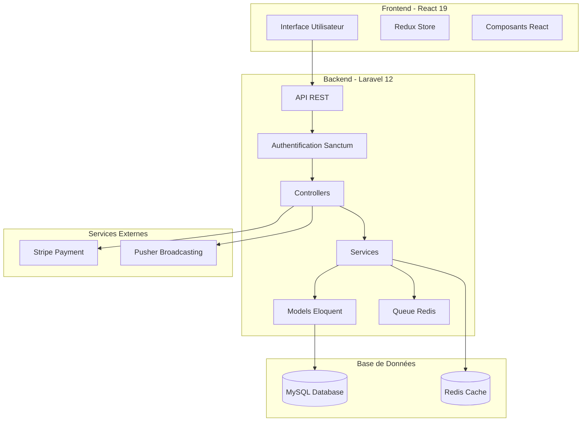
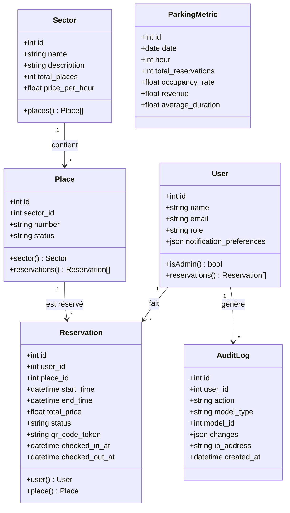
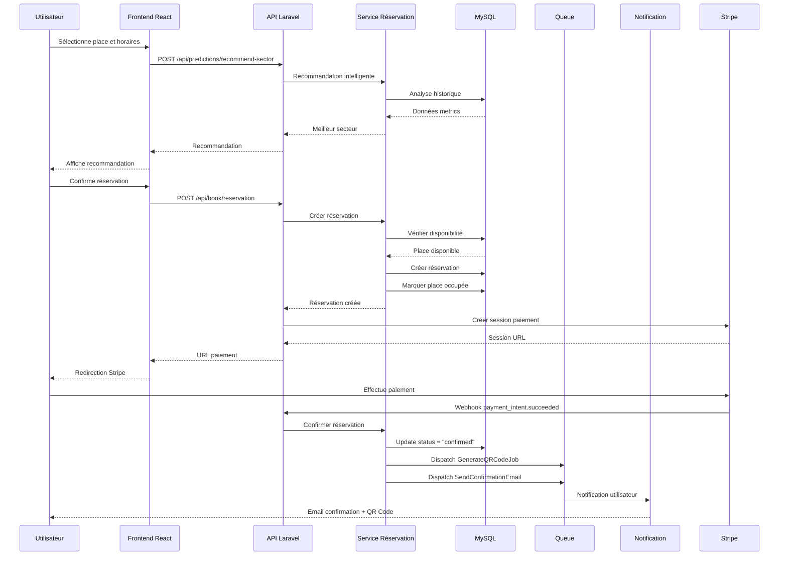

# 🏗️ Architecture Technique — Smart Parking System

## Vue d'ensemble

Ce document décrit l'architecture technique complète du système de gestion de parking intelligent avec diagrammes UML complets.

---

## 🎨 Architecture Globale



---

## 📊 Diagramme de Classes



---

## 🔄 Diagramme de Séquence - Réservation Complète



---

## 📱 Diagramme QR Code Check-in/Check-out
│  │  MySQL   │  │  Redis   │  │   Reverb   │  │  Stripe  │ │
│  │ Database │  │  Cache   │  │ WebSocket  │  │   API    │ │
│  └──────────┘  └──────────┘  └────────────┘  └──────────┘ │
└─────────────────────────────────────────────────────────────┘
```

---

## 📊 Modèle de données (ERD)

### Schéma relationnel

```
┌─────────────────────┐
│       USERS         │
├─────────────────────┤
│ id (PK)            │
│ name               │
│ email (unique)     │
│ password           │
│ role (enum)        │──┐
│ timestamps         │  │
└─────────────────────┘  │
                         │ 1:N
                         │
┌─────────────────────┐  │
│     SECTORS         │  │
├─────────────────────┤  │
│ id (PK)            │  │
│ name               │──┐│
│ description        │  ││
│ location           │  ││
│ timestamps         │  ││
└─────────────────────┘  ││
          1:N            ││
           │             ││
┌─────────────────────┐  ││
│      PLACES         │  ││
├─────────────────────┤  ││
│ id (PK)            │  ││
│ sector_id (FK) ────┘  ││
│ place_number       │   │
│ status (enum)      │──┐│
│ timestamps         │  ││
└─────────────────────┘  ││
          1:N            ││
           │             ││
┌─────────────────────┐  ││
│   RESERVATIONS      │  ││
├─────────────────────┤  ││
│ id (PK)            │  ││
│ user_id (FK) ──────┼──┘│
│ place_id (FK) ─────┘   │
│ start_time         │    │
│ end_time           │    │
│ status (enum)      │    │
│ amount (decimal)   │    │
│ paid (boolean)     │    │
│ timestamps         │────┐
└─────────────────────┘   │
          1:1             │
           │              │
┌─────────────────────┐   │
│  STRIPE_SESSIONS    │   │
├─────────────────────┤   │
│ id (PK)            │   │
│ reservation_id (FK)┼───┘
│ session_id (unique)│
│ status (enum)      │
│ timestamps         │
└─────────────────────┘

┌─────────────────────┐
│       TASKS         │
├─────────────────────┤
│ id (PK)            │
│ title              │
│ description        │
│ assigned_to (FK)   │──┐
│ status (enum)      │  │ N:1
│ priority           │  │
│ timestamps         │  │
└─────────────────────┘  │
                         │
         ┌───────────────┘
         │
┌─────────────────────┐
│    AUDIT_LOGS       │
├─────────────────────┤
│ id (PK)            │
│ user_id (FK) ──────┼─►
│ action             │
│ entity_type        │
│ entity_id          │
│ old_values (json)  │
│ new_values (json)  │
│ ip_address         │
│ user_agent         │
│ created_at         │
└─────────────────────┘
```

### Status et énumérations

#### User.role
- `admin` : Administrateur (accès complet)
- `user` : Utilisateur standard

#### Place.status
- `available` : Place disponible
- `reserved` : Place réservée
- `occupied` : Place occupée

#### Reservation.status
- `pending` : En attente de paiement
- `reserved` : Réservée et payée
- `parked` : Véhicule présent sur la place
- `finished` : Terminée
- `cancelled` : Annulée

---

## 🔄 Flux de données

### 1. Flux de réservation

```
[Client React]                [Laravel API]              [Services Externes]
      │                             │                            │
      ├─ GET /api/places ──────────►│                            │
      │                             ├─ Query DB                  │
      │◄─── Places disponibles ─────┤                            │
      │                             │                            │
      ├─ POST /api/book/reservation►│                            │
      │  {place_id, start, end}     ├─ Validate                  │
      │                             ├─ Create Reservation        │
      │                             │   (status: pending)         │
      │◄─── {reservation_id} ────────┤                            │
      │                             │                            │
      ├─ POST /api/pay/create/:id ──►│                            │
      │                             ├─ Create Stripe Session ───►│
      │                             │                            │
      │◄─── {checkout_url} ──────────┤◄────── session_id ────────┤
      │                             │                            │
      ├─ Redirect to Stripe ────────┼───────────────────────────►│
      │                             │                            │
      │                   [Webhook] │                            │
      │                             │◄─── payment_succeeded ──────┤
      │                             ├─ Update Reservation        │
      │                             │   (status: reserved)        │
      │                             ├─ Broadcast Event           │
      │                             │   (WebSocket)               │
      │◄──── Place status updated ───┤                            │
      │      (via WebSocket)        │                            │
```

### 2. Flux d'authentification

```
[React Client]              [Laravel API]                [DB]
      │                             │                      │
      ├─ POST /api/user/register ──►│                      │
      │  {name, email, password}    ├─ Validate            │
      │                             ├─ Hash password       │
      │                             ├─ Create User ───────►│
      │                             │                      │
      │◄─── {user, token} ───────────┤◄─────────────────────┤
      │                             │                      │
      ├─ Store token (localStorage) │                      │
      │                             │                      │
      ├─ GET /api/user ─────────────►│                      │
      │  Header: Bearer {token}     ├─ auth:sanctum        │
      │                             ├─ Verify token        │
      │                             ├─ Load User ─────────►│
      │◄─── {user} ──────────────────┤◄─────────────────────┤
```

### 3. Flux temps réel (WebSocket)

```
[Admin Dashboard]        [Reverb Server]         [Laravel Backend]
       │                        │                        │
       ├─ Subscribe to ─────────►│                        │
       │  "place.updated"       │                        │
       │                        │         [Event]        │
       │                        │◄─── PlaceStatusUpdated ┤
       │                        │      {place_id, status}│
       │                        │                        │
       │◄─── Broadcast event ────┤                        │
       ├─ Update UI             │                        │
       │  (place status)        │                        │
```

---

## 🔒 Sécurité

### Architecture de sécurité

#### 1. Authentification (Laravel Sanctum)
```
Client Request
    ↓
Bearer Token Validation
    ↓
User Identity Resolution
    ↓
Access Granted/Denied
```

**Avantages:**
- Token stateless (pas de session serveur)
- Révocation possible (table personal_access_tokens)
- Compatible SPA et mobile

#### 2. Autorisation (Middleware & Policies)

```php
// Middleware d'administration
Route::middleware(['auth:sanctum', 'admin'])->group(function () {
    // Routes admin uniquement
});

// Policy pour réservation
Gate::define('cancel-reservation', function ($user, $reservation) {
    return $user->id === $reservation->user_id || $user->isAdmin();
});
```

#### 3. Validation stricte (Form Requests)

Toutes les données entrantes sont validées:

```php
class StoreReservationRequest extends FormRequest
{
    public function rules(): array
    {
        return [
            'place_id' => 'required|exists:places,id',
            'start_time' => 'required|date|after:now',
            'end_time' => 'required|date|after:start_time',
        ];
    }
}
```

#### 4. Protection CSRF & CORS

```php
// CORS configuré pour frontend uniquement
'allowed_origins' => [env('FRONTEND_URL', 'http://localhost:5173')],
'allowed_methods' => ['GET', 'POST', 'PUT', 'DELETE'],
```

#### 5. Rate Limiting

```php
// 60 requêtes par minute par IP
RateLimiter::for('api', function (Request $request) {
    return Limit::perMinute(60)->by($request->ip());
});
```

#### 6. Audit Logging

Toutes les actions sensibles sont enregistrées:
- Changement de rôle utilisateur
- Annulation de réservation
- Modification de place
- Accès admin

---

## 📡 API REST

### Convention de nommage

```
GET    /api/resource          Liste (index)
GET    /api/resource/{id}     Détail (show)
POST   /api/resource          Création (store)
PUT    /api/resource/{id}     Mise à jour complète (update)
DELETE /api/resource/{id}     Suppression (destroy)
```

### Format de réponse standardisé

#### Succès (2xx)
```json
{
  "data": { ... },
  "message": "Success",
  "meta": {
    "page": 1,
    "per_page": 15,
    "total": 150
  }
}
```

#### Erreur (4xx, 5xx)
```json
{
  "message": "Validation failed",
  "errors": {
    "email": ["The email field is required."]
  }
}
```

### Authentification

Toutes les routes protégées requièrent:

```
Authorization: Bearer {sanctum_token}
```

---

## ⚡ Performance

### Stratégies d'optimisation

#### 1. Cache (Redis)
- Configuration utilisateur
- Places disponibles (TTL: 60s)
- Statistiques dashboard (TTL: 5min)

#### 2. Eager Loading (N+1 Query Problem)
```php
// ❌ Mauvais (N+1 problème)
$reservations = Reservation::all();
foreach ($reservations as $r) {
    echo $r->user->name; // Query additionnel
}

// ✅ Bon (Eager loading)
$reservations = Reservation::with('user', 'place')->get();
```

#### 3. Pagination
Toutes les listes utilisent la pagination:
```php
return PlaceResource::collection(
    Place::paginate(15)
);
```

#### 4. Queue pour tâches lourdes
- Envoi d'emails
- Génération de rapports
- Traitement paiements

```php
ProcessPayment::dispatch($reservation)->onQueue('payments');
```

---

## 🚀 Déploiement

### Architecture de déploiement

```
                     ┌──────────────┐
                     │   NGINX      │
                     │ Reverse Proxy│
                     │  (Port 80)   │
                     └──────┬───────┘
                            │
              ┌─────────────┴─────────────┐
              │                           │
      ┌───────▼─────┐            ┌────────▼─────┐
      │   React     │            │   Laravel    │
      │   (Vite)    │            │   (PHP-FPM)  │
      │  Port 5173  │            │  Port 8000   │
      └─────────────┘            └───────┬──────┘
                                         │
                        ┌────────────────┼────────────────┐
                        │                │                │
                 ┌──────▼────┐   ┌──────▼────┐   ┌──────▼────┐
                 │   MySQL   │   │   Redis   │   │  Reverb   │
                 │  Port 3306│   │ Port 6379 │   │ Port 8080 │
                 └───────────┘   └───────────┘   └───────────┘
```

### Docker Compose

Voir fichier `docker-compose.yml` (à créer dans prochaine étape)

---

## 📊 Monitoring

### Métriques à surveiller

#### Application
- Temps de réponse API (< 200ms)
- Taux d'erreur (< 1%)
- Disponibilité (> 99.5%)

#### Business
- Nombre de réservations/jour
- Taux d'occupation
- Revenus

#### Infrastructure
- CPU, RAM, Disk
- Connexions DB actives
- Queue backlog

---

## 🔄 CI/CD Pipeline

```
GitHub Push
    ↓
GitHub Actions Trigger
    ↓
Run Tests
    ├─ PHPUnit/Pest (Backend)
    ├─ Jest (Frontend)
    └─ Linting (Pint, ESLint)
    ↓
Build Docker Images
    ↓
Push to Registry (Docker Hub)
    ↓
Deploy to Production
    ↓
Health Check
    ↓
Success Notification
```

---

**Auteur:** [Votre nom]  
**Date:** 17 Mars 2026  
**Version:** 1.0
