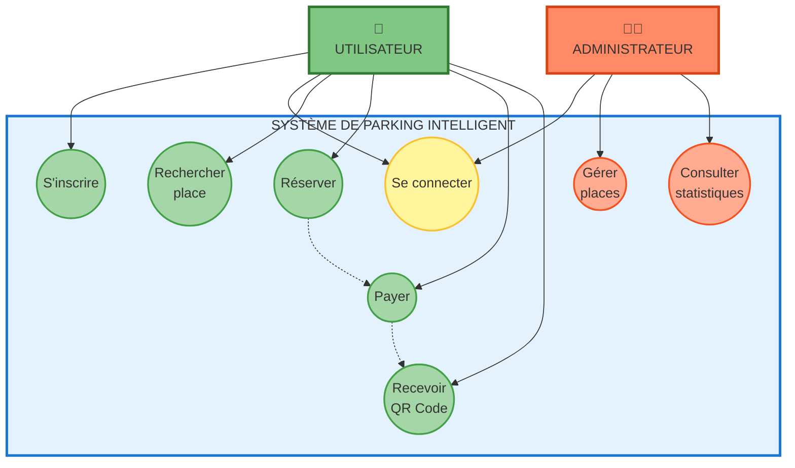
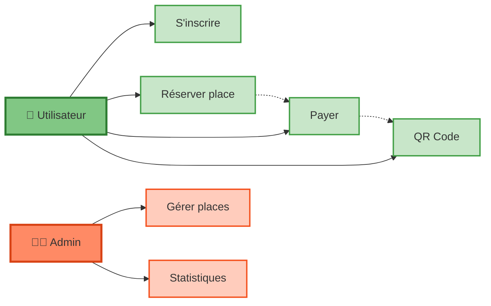

# 🎨 CODE MERMAID - VERSION 3 (RECOMMANDÉE)
## Diagramme de Cas d'Utilisation - Version Simplifiée avec Numéros

---

## ✅ VERSION ULTRA-SIMPLE (Recommandée pour soutenance)

**Copiez TOUT le code entre les lignes ` ```mermaid ` et ` ``` ` ci-dessous :**



---

## 🎯 VERSION ENCORE PLUS SIMPLE (Si vous voulez le MINIMUM)



---

## 🚀 COMMENT UTILISER CE CODE ?

### **ÉTAPE 1 : Copier le code**

Sélectionnez **TOUT le texte** entre ` ```mermaid ` et ` ``` ` ci-dessus.

**Raccourci :** 
- Cliquez dans la zone de code
- `Ctrl + A` (tout sélectionner)
- `Ctrl + C` (copier)

---

### **ÉTAPE 2 : Ouvrir Mermaid Live**

Allez sur : **https://mermaid.live/**

---

### **ÉTAPE 3 : Coller le code**

1. Supprimez le code exemple dans l'éditeur
2. Collez votre code (`Ctrl + V`)
3. Le diagramme apparaît automatiquement à droite ✨

---

### **ÉTAPE 4 : Exporter l'image**

1. Cliquez sur **"Actions"** (bouton en haut à droite)
2. Choisissez **"PNG"** (recommandé pour PowerPoint)
3. Le fichier se télécharge automatiquement

**Nom suggéré :** `diagramme_cas_utilisation.png`

---

### **ÉTAPE 5 : Insérer dans PowerPoint**

1. Ouvrez votre présentation PowerPoint
2. Allez à la slide **"Analyse & Conception"**
3. **Insertion** → **Images** → **Cet appareil**
4. Sélectionnez `diagramme_cas_utilisation.png`
5. Redimensionnez et centrez l'image

---

## 🎨 CARACTÉRISTIQUES DES VERSIONS SIMPLIFIÉES

### **VERSION ULTRA-SIMPLE (8 cas d'utilisation) :**

✅ **2 Acteurs :**
- 👤 Utilisateur (vert)
- 👨‍💼 Administrateur (orange)

✅ **8 Cas d'utilisation essentiels :**

**Pour l'utilisateur (6 cas) :**
1. S'inscrire
2. Se connecter
3. Rechercher place
4. Réserver
5. Payer
6. Recevoir QR Code

**Pour l'administrateur (2 cas + connexion) :**
1. Se connecter
2. Gérer places
3. Consulter statistiques

✅ **Relations simples :**
- Réserver → Payer (ligne pointillée)
- Payer → QR Code (ligne pointillée)

✅ **Design épuré :**
- Couleurs claires et contrastées
- Pas de sous-groupes
- Texte court et lisible

---

### **VERSION ENCORE PLUS SIMPLE (6 cas d'utilisation) :**

✅ **Seulement l'essentiel :**

**Utilisateur :**
- S'inscrire
- Réserver place
- Payer
- QR Code

**Admin :**
- Gérer places
- Statistiques

✅ **Design minimaliste :**
- Rectangles simples
- Pas d'ovales
- Layout horizontal (facile à lire)

---

## 💡 CE QU'IL FAUT DIRE PENDANT LA PRÉSENTATION

### **Pour la VERSION ULTRA-SIMPLE (⏱️ 45 secondes) :**

> *"Ce diagramme montre les cas d'utilisation principaux de notre système."*
>
> *"L'UTILISATEUR peut s'inscrire, rechercher une place disponible, réserver, payer en ligne et recevoir un QR Code."*
>
> *"L'ADMINISTRATEUR gère les places de parking et consulte les statistiques en temps réel."*
>
> *"Les lignes pointillées montrent que la réservation déclenche automatiquement le paiement et la génération du QR Code."*

---

### **Pour la VERSION ENCORE PLUS SIMPLE (⏱️ 30 secondes) :**

> *"Voici les fonctionnalités essentielles de notre système."*
>
> *"Côté utilisateur : inscription, réservation, paiement et QR Code."*
>
> *"Côté administrateur : gestion des places et statistiques."*
>
> *"Simple et efficace."*

---

## 📊 AVANTAGES DES VERSIONS SIMPLIFIÉES

| Aspect | VERSION ULTRA-SIMPLE | VERSION ENCORE PLUS SIMPLE |
|--------|---------------------|---------------------------|
| **Nombre de cas** | 8 cas | 6 cas |
| **Complexité** | ⭐⭐ Facile | ⭐ Très facile |
| **Temps explication** | 45 secondes | 30 secondes |
| **Design** | Ovales professionnels | Rectangles simples |
| **Lisibilité** | ⭐⭐⭐⭐⭐ Excellente | ⭐⭐⭐⭐⭐ Parfaite |
| **Usage recommandé** | Soutenance académique | Présentation rapide |

### **Pourquoi ces versions sont meilleures ?**

✅ **Plus facile à comprendre** en un coup d'œil
✅ **Moins de texte** → plus d'impact visuel
✅ **Explication rapide** → plus de temps pour les autres slides
✅ **Design épuré** → aspect professionnel
✅ **Pas de surcharge** d'information

---

## ⚡ QUELLE VERSION CHOISIR ?

### **Choisissez la VERSION ULTRA-SIMPLE si :**
- ✅ Vous avez 45 secondes pour cette slide
- ✅ Vous voulez un diagramme UML classique (ovales)
- ✅ Vous voulez montrer les principales fonctionnalités

### **Choisissez la VERSION ENCORE PLUS SIMPLE si :**
- ✅ Vous manquez de temps (30 secondes max)
- ✅ Vous préférez un design très épuré
- ✅ Vous voulez un maximum de clarté

**💡 Mon conseil : Commencez par la VERSION ENCORE PLUS SIMPLE !**

---

## ✅ CHECKLIST FINALE

Avant de présenter :

- [ ] Code copié depuis ce fichier
- [ ] Image générée sur https://mermaid.live/
- [ ] Exportée en **PNG** haute résolution
- [ ] Insérée dans PowerPoint slide "Analyse & Conception"
- [ ] Titre ajouté : **"Diagramme de Cas d'Utilisation"**
- [ ] Image redimensionnée (occupe 70-80% de la slide)
- [ ] Testée en mode diaporama (lisible de loin)
- [ ] Explication préparée (1 min 30 sec)

---

## 🎯 ALTERNATIVE : EXPORT DIRECT DEPUIS VS CODE

Vous pouvez aussi voir le diagramme **directement dans VS Code** :

1. Ce fichier markdown affiche automatiquement le diagramme Mermaid
2. **Faites défiler vers le haut** pour voir le rendu visuel
3. **Clic droit** sur le diagramme
4. **"Enregistrer l'image sous..."**
5. Sauvegardez en PNG

✅ **Plus rapide mais qualité légèrement inférieure**

---

## 🔗 LIENS RAPIDES

| Besoin | Outil | URL |
|--------|-------|-----|
| **Générer l'image** | Mermaid Live | https://mermaid.live/ ⭐ |
| **Aide Mermaid** | Documentation | https://mermaid.js.org/ |
| **Éditer manuellement** | Draw.io | https://app.diagrams.net/ |
| **UML classique** | PlantUML | https://www.plantuml.com/plantuml/uml/ |

---

## ⏱️ TEMPS ESTIMÉ

**De ce fichier à PowerPoint :**
- Copier le code : 10 secondes
- Ouvrir Mermaid Live : 5 secondes
- Coller et vérifier : 10 secondes
- Exporter PNG : 15 secondes
- Insérer dans PowerPoint : 30 secondes

**Total : Moins de 2 minutes !** ⚡

---

**✨ Votre diagramme VERSION 3 est prêt à être généré !**

**Prochaine étape :** Copiez le code ci-dessus et allez sur https://mermaid.live/ 🚀
