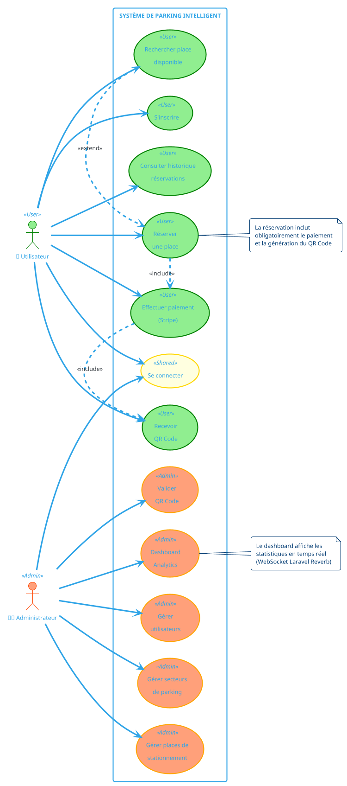
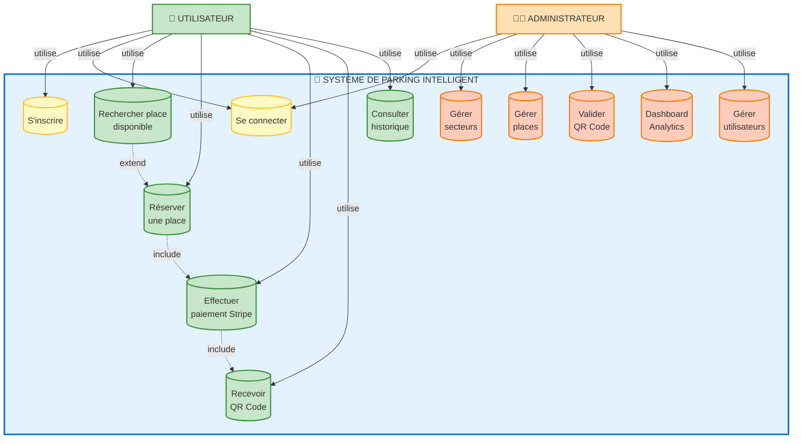

# 🎨 DIAGRAMME DE CAS D'UTILISATION UML - FORMAT IMAGE
## Système de Parking Intelligent

---

## ✅ DIAGRAMMES MERMAID GÉNÉRÉS

**3 versions différentes ont été générées ci-dessus :**

### **VERSION 1 : Diagramme Standard (Top to Bottom)**
- Layout vertical classique
- Tous les cas d'utilisation visibles
- Idéal pour rapport écrit

### **VERSION 2 : Diagramme Organisé par Acteur (Left to Right)**
- Layout horizontal
- Cas groupés par type d'acteur
- Meilleure séparation visuelle

### **VERSION 3 : Diagramme Simplifié avec Numéros** ⭐ **RECOMMANDÉ POUR PRÉSENTATION**
- Cas d'utilisation numérotés
- Groupés par fonctionnalité (Gestion, Réservation, Administration)
- Plus facile à expliquer oralement
- Couleurs par catégorie

**Caractéristiques communes :**
- ✅ 2 Acteurs (Utilisateur, Administrateur)
- ✅ 12 Cas d'utilisation
- ✅ Relations include/extend
- ✅ Couleurs distinctives par acteur
- ✅ Format professionnel

---

## 📝 CODE PLANTUML - VERSION CLASSIQUE UML

Pour générer un **diagramme UML classique** avec des ovales, utilisez ce code sur **PlantUML** :

### **Code PlantUML :**



---

## 🌐 COMMENT GÉNÉRER L'IMAGE ?

### **MÉTHODE 1 : PlantUML Online** ⭐ **RECOMMANDÉ**

1. Allez sur : **https://www.plantuml.com/plantuml/uml/**
2. Copiez-collez le code PlantUML ci-dessus
3. Cliquez sur **"Submit"**
4. Téléchargez l'image (PNG/SVG)

**Avantages :** 
- ✅ Diagramme UML classique avec ovales
- ✅ Export PNG, SVG, PDF
- ✅ Haute qualité professionnelle

---

### **MÉTHODE 2 : Mermaid Live Editor**

1. Allez sur : **https://mermaid.live/**
2. Copiez-collez le code Mermaid (voir section suivante)
3. Exportez en PNG ou SVG

**Avantages :**
- ✅ Éditeur interactif en temps réel
- ✅ Export facile
- ✅ Design moderne

---

### **MÉTHODE 3 : Draw.io (Diagrams.net)** 💡 **MANUEL MAIS FLEXIBLE**

1. Allez sur : **https://app.diagrams.net/**
2. Nouveau diagramme → UML → Use Case Diagram
3. Utilisez les formes :
   - **Actor** (bonhomme) pour Utilisateur et Admin
   - **Use Case** (ovale) pour chaque cas
   - **Subsystem** (rectangle) pour le système
4. Exportez en PNG/SVG/PDF

**Avantages :**
- ✅ Contrôle total sur le design
- ✅ Facile à personnaliser
- ✅ Export multi-formats

---

### **MÉTHODE 4 : Visual Paradigm Online**

1. Allez sur : **https://online.visual-paradigm.com/**
2. Create → UML → Use Case Diagram
3. Dessinez le diagramme
4. Exportez

**Avantages :**
- ✅ Outil professionnel UML
- ✅ Templates prédéfinis
- ✅ Version gratuite disponible

---

## 📋 CODE MERMAID (Pour référence)



---

## 🎨 CODE POUR LUCIDCHART

Si vous préférez **Lucidchart** :

1. Allez sur : **https://www.lucidchart.com/**
2. Nouveau document → UML → Use Case Diagram
3. Importez depuis PlantUML OU dessinez manuellement
4. Exportez en PNG/PDF

---

## 🖼️ TEMPLATE POWERPOINT ALTERNATIF

Si vous voulez créer le diagramme **directement dans PowerPoint** :

### **Éléments à utiliser :**

#### 1. **Acteurs** (Insertion → Icônes → "person")
```
👤 Utilisateur (à gauche)
👨‍💼 Administrateur (à droite)
```

#### 2. **Système** (Rectangle arrondi bleu)
```
Couleur : #1976D2
Texte : "SYSTÈME DE PARKING INTELLIGENT"
Dimension : Large (couvre 60% de la slide)
```

#### 3. **Cas d'utilisation** (Ovales)
```
Pour Utilisateur : Ovales vertes (#4CAF50)
Pour Admin : Ovales oranges (#FF9800)
Partagés : Ovales jaunes (#FBC02D)

Texte centré, police 12pt
```

#### 4. **Flèches** (Connecteurs)
```
Utilisateur → Cas : Ligne pleine
Admin → Cas : Ligne pleine
Include/Extend : Ligne pointillée
```

---

## 📊 LÉGENDE DU DIAGRAMME

```
┌─────────────────────────────────────────────────┐
│  LÉGENDE                                        │
├─────────────────────────────────────────────────┤
│  👤 = Acteur (Utilisateur)                      │
│  👨‍💼 = Acteur (Administrateur)                   │
│  ( ) = Cas d'utilisation                        │
│  ──► = Association (utilise)                    │
│  -.-> = Relation include/extend                 │
│                                                 │
│  🟢 Vert  = Fonctionnalités utilisateur         │
│  🟠 Orange = Fonctionnalités administrateur     │
│  🟡 Jaune = Fonctionnalités partagées           │
└─────────────────────────────────────────────────┘
```

---

## 📝 DESCRIPTION DÉTAILLÉE DES RELATIONS

### **Relations <<include>>** (Inclusion obligatoire)

```
Réserver une place ──include──> Effectuer paiement
                                      │
                                      ├──include──> Recevoir QR Code
```

**Signification :** 
- Quand un utilisateur réserve, il DOIT payer
- Quand il paie, il DOIT recevoir un QR Code

---

### **Relations <<extend>>** (Extension optionnelle)

```
Rechercher place ──extend──> Réserver une place
```

**Signification :**
- L'utilisateur peut rechercher sans réserver
- Mais s'il veut réserver, il doit d'abord rechercher

---

## ✅ CHECKLIST EXPORT IMAGE

Avant d'utiliser le diagramme dans votre présentation :

- [ ] Image exportée en **PNG** (haute résolution : 300 DPI minimum)
- [ ] Ou exportée en **SVG** (vectoriel, meilleure qualité)
- [ ] Texte lisible (police ≥ 14pt)
- [ ] Couleurs cohérentes avec votre charte graphique
- [ ] Acteurs clairement identifiés
- [ ] Flèches bien orientées
- [ ] Légende ajoutée si nécessaire
- [ ] Image testée en mode présentation (visible de loin)

---

## 🚀 RECOMMANDATION FINALE

### **Pour votre soutenance, utilisez :**

1. **PlantUML Online** pour générer un diagramme UML classique professionnel
2. Exportez en **PNG 300 DPI** ou **SVG**
3. Insérez dans PowerPoint slide **"Analyse & Conception"**
4. Ajoutez un titre : **"Diagramme de Cas d'Utilisation"**
5. Préparez l'explication (1 min 30 sec)

---

## 🔗 LIENS RAPIDES

| Outil | URL | Usage |
|-------|-----|-------|
| **PlantUML Online** | https://www.plantuml.com/plantuml/uml/ | ⭐ Diagramme UML classique |
| **Mermaid Live** | https://mermaid.live/ | Diagramme moderne |
| **Draw.io** | https://app.diagrams.net/ | Manuel, flexible |
| **Lucidchart** | https://www.lucidchart.com/ | Professionnel |
| **Visual Paradigm** | https://online.visual-paradigm.com/ | UML complet |

---

## 💡 CONSEIL POUR LA PRÉSENTATION

**Ce qu'il faut dire en montrant le diagramme :**

> *"Voici le diagramme de cas d'utilisation UML de notre système."*
>
> *"On identifie 2 acteurs principaux :"*
> - *"L'Utilisateur en vert, qui peut s'inscrire, rechercher des places, réserver et payer"*
> - *"L'Administrateur en orange, qui gère les secteurs, les places et consulte le dashboard"*
>
> *"Les relations 'include' montrent que la réservation inclut obligatoirement le paiement et la génération du QR Code."*
>
> *"La relation 'extend' indique que la recherche peut être étendue par une réservation."*

⏱️ **Temps : 1 minute 30 secondes maximum**

---

**✨ Votre diagramme est prêt ! Choisissez votre méthode préférée et générez l'image.**
