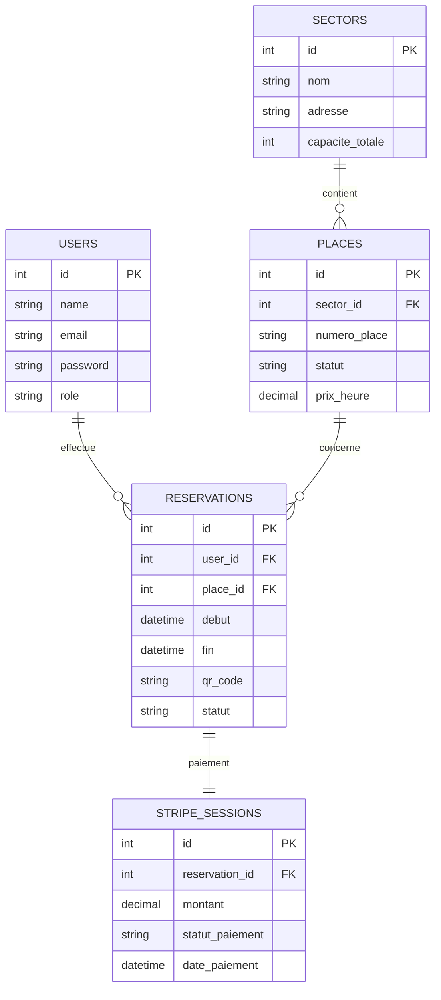
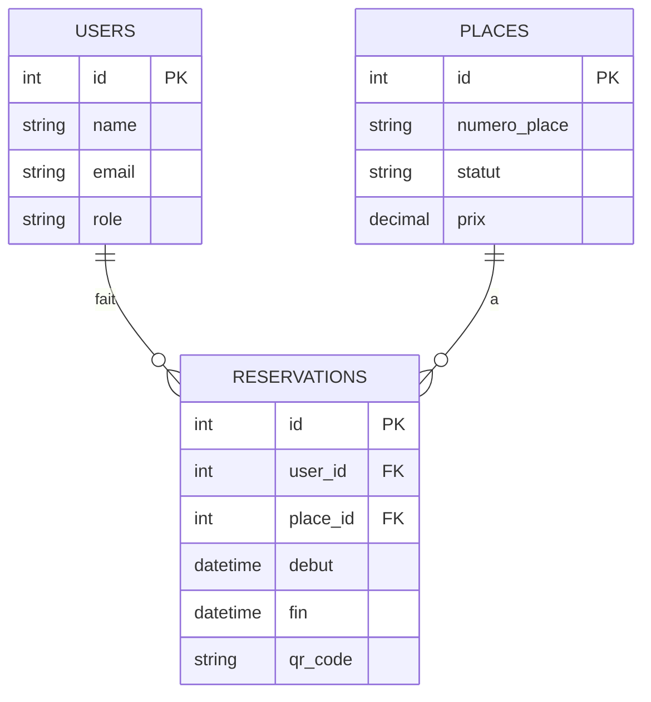
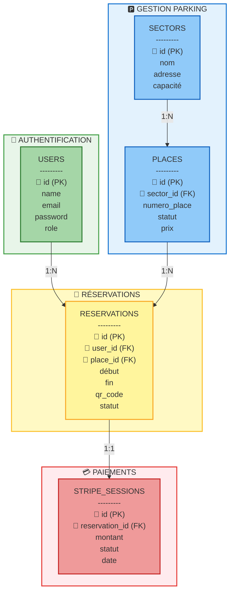

# 🗄️ SCHÉMA DE BASE DE DONNÉES - VERSION SIMPLE
## Système de Parking Intelligent

---

## ✅ VERSION ULTRA-SIMPLE (Recommandée pour présentation)

**Copiez TOUT le code entre les lignes ` ```mermaid ` et ` ``` ` ci-dessous :**



---

## 🎯 VERSION ENCORE PLUS SIMPLE (Minimaliste - 4 tables)



---

## 📊 VERSION TABLEAU (Pour PowerPoint)

Si vous préférez un tableau simple au lieu d'un diagramme :

### **TABLE 1 : USERS (Utilisateurs)**

| Champ | Type | Description |
|-------|------|-------------|
| **id** 🔑 (PK) | INT | Identifiant unique |
| name | VARCHAR(100) | Nom complet |
| email | VARCHAR(100) | Email unique |
| password | VARCHAR(255) | Mot de passe crypté |
| role | ENUM | utilisateur / admin |

---

### **TABLE 2 : SECTORS (Secteurs)**

| Champ | Type | Description |
|-------|------|-------------|
| **id** 🔑 (PK) | INT | Identifiant unique |
| nom | VARCHAR(100) | Nom du secteur |
| adresse | VARCHAR(255) | Adresse complète |
| capacite_totale | INT | Nombre total de places |

---

### **TABLE 3 : PLACES (Places de parking)**

| Champ | Type | Description |
|-------|------|-------------|
| **id** 🔑 (PK) | INT | Identifiant unique |
| **sector_id** 🔗 (FK) | INT | Référence au secteur |
| numero_place | VARCHAR(10) | Numéro de la place (A1, B5...) |
| statut | ENUM | disponible / occupée / hors_service |
| prix_heure | DECIMAL(8,2) | Prix par heure (MAD) |

---

### **TABLE 4 : RESERVATIONS (Réservations)**

| Champ | Type | Description |
|-------|------|-------------|
| **id** 🔑 (PK) | INT | Identifiant unique |
| **user_id** 🔗 (FK) | INT | Référence utilisateur |
| **place_id** 🔗 (FK) | INT | Référence place |
| debut | DATETIME | Date/heure début |
| fin | DATETIME | Date/heure fin |
| qr_code | VARCHAR(255) | Token QR Code unique |
| statut | ENUM | en_attente / confirmée / annulée |

---

### **TABLE 5 : STRIPE_SESSIONS (Paiements)**

| Champ | Type | Description |
|-------|------|-------------|
| **id** 🔑 (PK) | INT | Identifiant unique |
| **reservation_id** 🔗 (FK) | INT | Référence réservation |
| montant | DECIMAL(10,2) | Montant payé (MAD) |
| statut_paiement | VARCHAR(50) | succeeded / pending / failed |
| date_paiement | DATETIME | Date du paiement |

---

**Légende :**
- 🔑 = Clé primaire (Primary Key)
- 🔗 = Clé étrangère (Foreign Key)

---

## 🔗 RELATIONS ENTRE LES TABLES

```
┌──────────────────────────────────────────────────────────┐
│  RELATIONS PRINCIPALES                                   │
├──────────────────────────────────────────────────────────┤
│                                                          │
│  USERS (1) ────────► (N) RESERVATIONS                   │
│  Un utilisateur peut avoir plusieurs réservations       │
│                                                          │
│  SECTORS (1) ──────► (N) PLACES                         │
│  Un secteur contient plusieurs places                   │
│                                                          │
│  PLACES (1) ───────► (N) RESERVATIONS                   │
│  Une place peut avoir plusieurs réservations            │
│                                                          │
│  RESERVATIONS (1) ─► (1) STRIPE_SESSIONS                │
│  Chaque réservation a un paiement unique                │
│                                                          │
└──────────────────────────────────────────────────────────┘
```

---

## 📝 EXPLICATION POUR LA PRÉSENTATION

### **Ce qu'il faut dire (⏱️ 1 minute) :**

> *"Voici le schéma de notre base de données MySQL."*
>
> *"Elle contient 5 tables principales :"*
>
> **1. USERS** - *"Stocke les informations des utilisateurs et administrateurs"*
>
> **2. SECTORS** - *"Représente les différents secteurs de parking"*
>
> **3. PLACES** - *"Contient toutes les places de stationnement avec leur statut et prix"*
>
> **4. RESERVATIONS** - *"Enregistre toutes les réservations avec le QR Code unique"*
>
> **5. STRIPE_SESSIONS** - *"Gère les paiements en ligne via Stripe"*
>
> *"Les relations sont simples :"*
> - *"Un utilisateur peut faire plusieurs réservations"*
> - *"Une place peut être réservée plusieurs fois (à des moments différents)"*
> - *"Chaque réservation est liée à un paiement Stripe"*

---

## 🎨 DIAGRAMME COLORÉ (Version professionnelle)



---

## 🚀 COMMENT UTILISER CE CODE ?

### **MÉTHODE 1 : Générer avec Mermaid Live**

1. **Copiez** le code de la VERSION ULTRA-SIMPLE ci-dessus
2. **Allez sur** https://mermaid.live/
3. **Collez** le code
4. **Exportez** en PNG
5. **Insérez** dans PowerPoint

### **MÉTHODE 2 : Utiliser le tableau**

1. **Copiez** les tableaux de la VERSION TABLEAU
2. **Collez** directement dans PowerPoint
3. **Formatez** avec votre charte graphique

### **MÉTHODE 3 : Draw.io (Création manuelle)**

1. **Allez sur** https://app.diagrams.net/
2. **Nouveau diagramme** → Entity Relationship Diagram
3. **Ajoutez** les 5 tables avec leurs champs
4. **Reliez-les** avec des connecteurs
5. **Exportez** en PNG

---

## 📊 STATISTIQUES DE LA BASE DE DONNÉES

```
📊 NOMBRE DE TABLES : 5
   - 1 table Utilisateurs (USERS)
   - 2 tables Parking (SECTORS, PLACES)
   - 1 table Réservations (RESERVATIONS)
   - 1 table Paiements (STRIPE_SESSIONS)

🔗 NOMBRE DE RELATIONS : 4
   - USERS → RESERVATIONS (1:N)
   - SECTORS → PLACES (1:N)
   - PLACES → RESERVATIONS (1:N)
   - RESERVATIONS → STRIPE_SESSIONS (1:1)

🔑 CLÉ PRIMAIRE : id (auto-increment) sur chaque table
🔗 CLÉS ÉTRANGÈRES : 4 (sector_id, user_id, place_id, reservation_id)

💾 MOTEUR : InnoDB (MySQL 8.0)
🔐 ENCODAGE : UTF8MB4
```

---

## ✅ CHECKLIST POUR LA PRÉSENTATION

- [ ] Diagramme généré (Mermaid ou Draw.io)
- [ ] Image exportée en PNG haute résolution
- [ ] Insérée dans slide "Analyse & Conception" ou "Base de Données"
- [ ] Titre ajouté : **"Schéma de la Base de Données"**
- [ ] Les 5 tables sont visibles
- [ ] Relations clairement identifiées
- [ ] Légende ajoutée (🔑 = PK, 🔗 = FK)
- [ ] Explication préparée (1 minute)

---

## 💡 CONSEIL POUR POWERPOINT

### **Slide recommandée :**

```
┌──────────────────────────────────────────────────────────┐
│  BASE DE DONNÉES - MODÈLE RELATIONNEL                   │
├──────────────────────────────────────────────────────────┤
│                                                          │
│  [VOTRE DIAGRAMME ICI - CENTRÉ]                         │
│                                                          │
│  📊 5 Tables | 4 Relations | MySQL 8.0 + Redis          │
│                                                          │
│  Légende : 🔑 Clé primaire | 🔗 Clé étrangère           │
└──────────────────────────────────────────────────────────┘
```

---

## 🎯 QUELLE VERSION CHOISIR ?

### **VERSION ULTRA-SIMPLE (Diagramme ERD avec 5 tables)** ⭐ **RECOMMANDÉE**
- ✅ Professionnel et complet
- ✅ Montre toutes les relations
- ✅ Facile à générer avec Mermaid Live

### **VERSION ENCORE PLUS SIMPLE (4 tables)**
- ✅ Minimaliste (sans secteurs)
- ✅ Très rapide à expliquer
- ✅ Pour présentation courte

### **VERSION TABLEAU**
- ✅ Détails de chaque champ
- ✅ Copier-coller direct dans PowerPoint
- ✅ Pour documentation détaillée

### **VERSION COLORÉE (Par fonctionnalité)**
- ✅ Design moderne avec groupes
- ✅ Couleurs par catégorie
- ✅ Impact visuel maximal

---

## ⏱️ TEMPS ESTIMÉ

**De ce fichier à PowerPoint :**
- Copier le code Mermaid : 10 secondes
- Générer sur Mermaid Live : 5 secondes
- Exporter PNG : 15 secondes
- Insérer dans PowerPoint : 30 secondes

**Total : 1 minute !** ⚡

---

**✨ Votre schéma de base de données est prêt !**

**Prochaine étape :** Copiez le code ci-dessus et générez l'image sur https://mermaid.live/ 🚀
